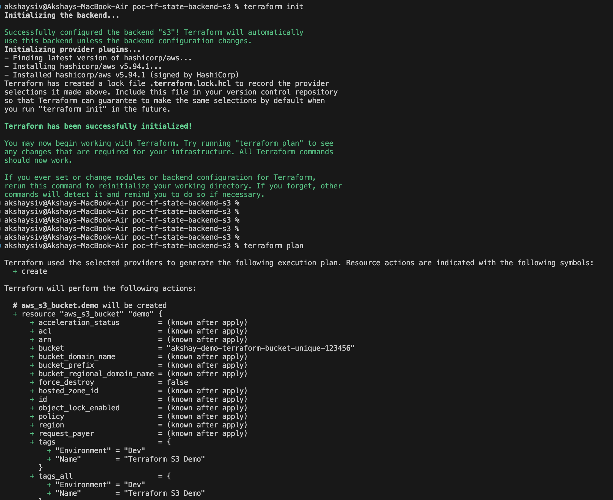
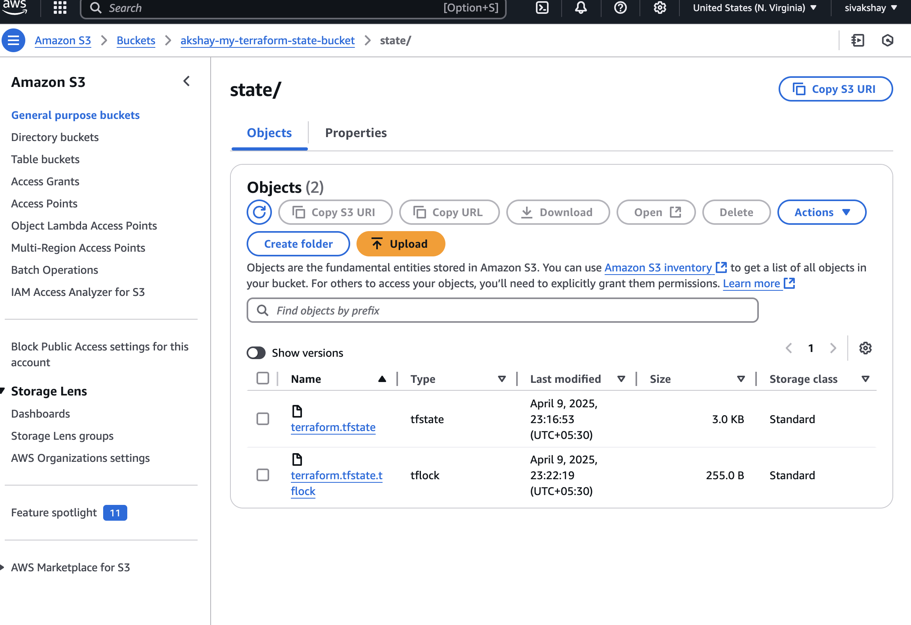

# Terraform S3 Native Locking Demo

This project demonstrates the use of **Terraform v1.10+** with **native S3 backend locking**, a new feature that eliminates the need for a DynamoDB table when managing Terraform state.

## 🚀 What's New?

Terraform now supports native `.tflock` files in S3. By enabling `use_lockfile = true` in your backend configuration, Terraform will automatically manage state locks using S3 — no external lock tables needed.

## 📁 Project Structure

```
.
├── main.tf          # Creates a sample S3 bucket
├── backend.tf       # Configures S3 backend with native locking
├── variables.tf     # Input variables for region and bucket name
└── outputs.tf       # (Optional) Outputs to show bucket details
```

## 🛠️ Prerequisites

- Terraform v1.10 or later
- S3 bucket must exist (Terraform backend cannot create it)

## 🌐 Backend Configuration (`backend.tf`)

```hcl
terraform {
  backend "s3" {
    bucket        = "akshay-my-terraform-state-bucket"
    key           = "state/terraform.tfstate"
    region        = "us-east-1"
    encrypt       = true
    use_lockfile  = true
  }
}
```

> ✅ Make sure the S3 bucket is created and versioning is enabled before initializing.

## 🪣 Sample Resource (`main.tf`)

```hcl
resource "aws_s3_bucket" "demo" {
  bucket = var.bucket_name

  tags = {
    Name        = "Terraform S3 Demo"
    Environment = "Dev"
  }
}
```

## 📦 Initialize & Apply

```bash
terraform init
terraform apply
```


During `apply`, you’ll see a `.tflock` file appear in your S3 bucket. It disappears automatically when the plan/apply completes



## 🔐 Benefits of Native Locking

- No need for DynamoDB
- Easier setup and maintenance
- Works seamlessly with CI/CD pipelines

## 📘 References

- [Terraform v1.10 Release Notes](https://github.com/hashicorp/terraform/releases/tag/v1.10.0)
- [Terraform S3 Backend Documentation](https://developer.hashicorp.com/terraform/language/settings/backends/s3)

---